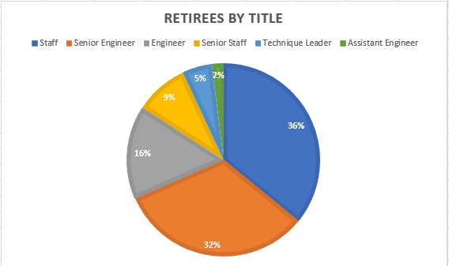

# Employee Database with SQL

## Overview

The purpose of this analysis is to combine all documentation provided by Bobby from Pewlett Hackard into a fully functional database so we can use SQL to pull specific information about upcoming retirees or the "silver tsunami". We performed various queries regarding employees and management who's birth dates fall between 1952 - 1955 and grouped them according to their titles and departments as well as getting a complete count on the total employees who are retiring. We also performed queries for current employees born during 1965 to gather a list of potential employees to pitch the new mentorship program Pewlett Hackard will be starting in order to account for so many employees leaving.

## Results

- The total amount of employees retiring is 90,398
- Employees under Staff and Senior Engineering titles are equal to 68% of the total amount of retirees
- We have 1,940 possible mentors that we can pitch for the mentorship program
- Each of the 6 titles contains a large amount of possible mentors which will take the edge off in case some don't accept the position

## Summary

The amount of roles that will need to be filled as the "silver tsunami" begins to make an impact would be exactly 90,398 with our highest roles leaving in Staff (32,452) and Senior Engineering (29,415).	

With about 30% of PH's employees leaving due to the "silver tsunami", the next generation of PH's employees should be prepped to fulfill the roles that will be left empty. The new mentorship program will aim to give proper training and guidance for less tenured employees. Meanwhile, it's strongly suggested to start hiring to account for the 90,000+ employees who will be leaving and even overhire since in a few years the next silver tsunami will take away more employees. With PH having 300,024 total employees, it would be best to aim toward ahcieving a higher employee count just to compensate for attrition as well as upcoming retirments.

To supplement more decision making toward the "Silver Tsunami" I would recommend the following queries:
- Create a query that pulls the salaries of upcoming retirees to help obtain an average of retiree salaries and can help with determining retirement packages.
- Create a query that pulls a count of genders to see how many females to males are leaving the company overall and within each title as well.
